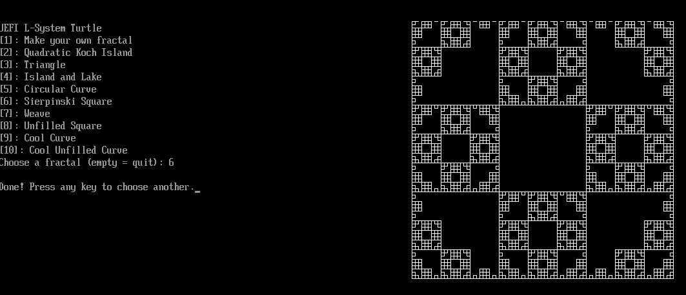

# UEFI L-System & Turtle Graphics

This project implements an L-System as described in _The Algorithmic Beauty Of Plants, by  Przemyslaw Prusinkiewicz, Aristid Lindenmayer_. 

It consists of a string expander system, based on dynamic rules, which are then run on an initial input ("axiom").

The result of that L-System is then used to direct the turtle to draw a given shape.

All of this is implemented via TianoCore's EDKII development environment, in C.

## Building

To build, setup EDKII and then put this directory into `MdeModulePkg/Application`, and then you can build the `.efi` file.
